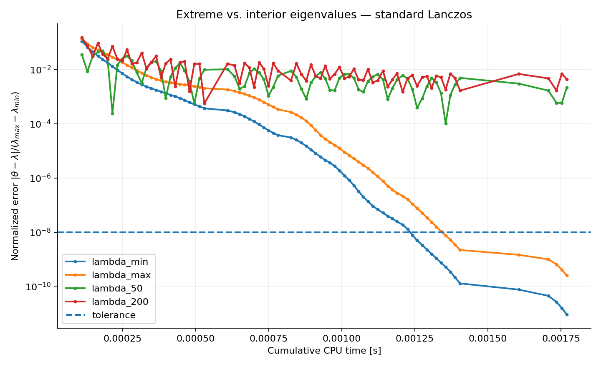
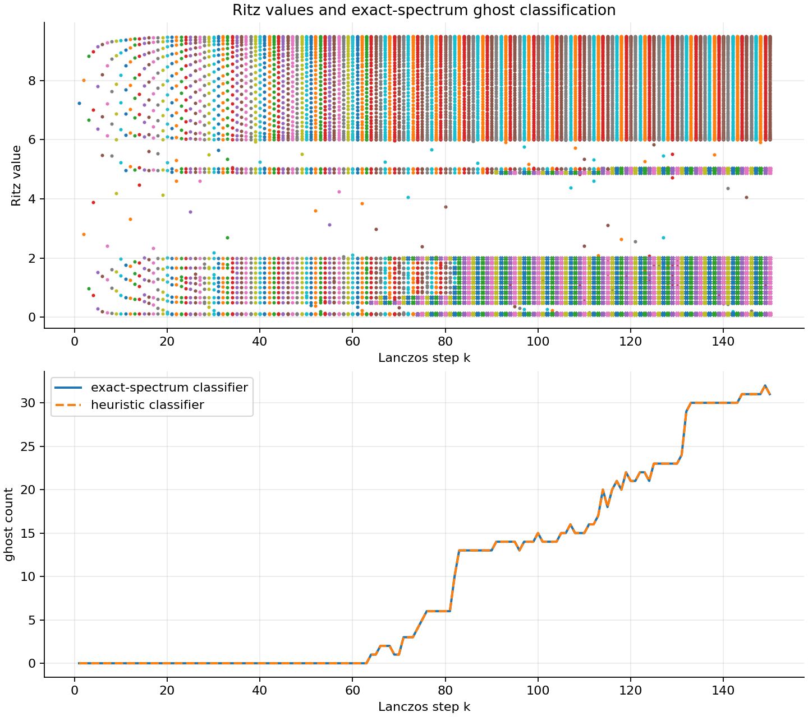
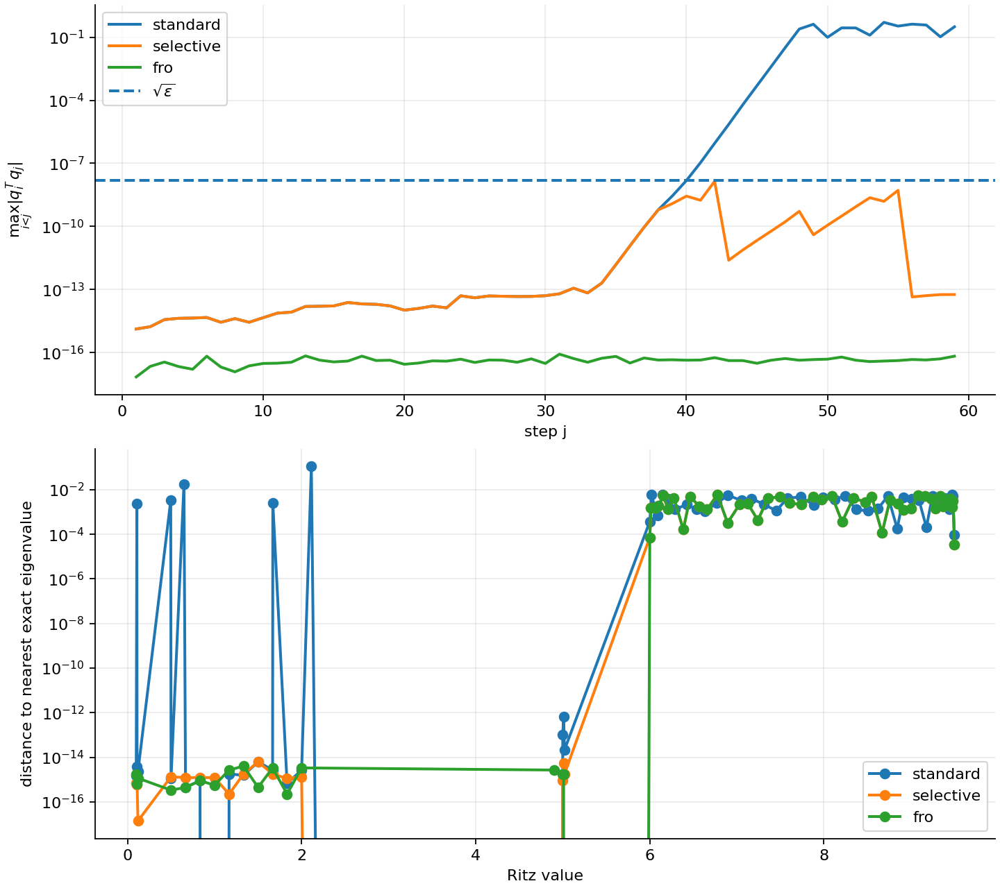
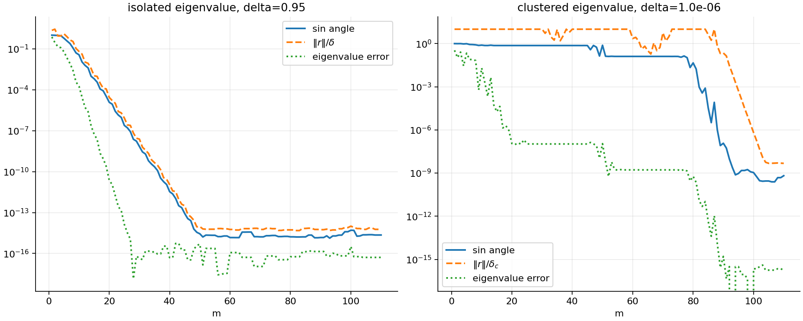

# Numerical Linear Algebra: Krylov and Lanczos Methods

Python implementations and numerical experiments for **Rayleigh-Ritz projection, Krylov subspaces, symmetric Lanczos eigensolvers, re-orthogonalization, shift-and-invert spectral transformations, and eigenvalue/eigenvector error analysis**.

The project combines the mathematical structure of projection methods with reproducible numerical experiments. Particular attention is given to the behavior of Lanczos in finite precision: convergence of extreme versus interior eigenvalues, loss of orthogonality, ghost Ritz values, full and selective re-orthogonalization, and the role of spectral separation in eigenvalue and eigenvector accuracy.

A complete mathematical treatment is included in the [full Numerical Linear Algebra report](report/Numerical_Linear_Algebra.pdf).

## Mathematical framework

Let $A\in\mathbb{R}^{n\times n}$ be real and symmetric and let $v_1$ be a nonzero starting vector. The Krylov subspace of dimension $m$ is

```math
\mathcal K_m(A,v_1)
=
\operatorname{span}\{v_1,Av_1,\ldots,A^{m-1}v_1\}.
```

Rayleigh-Ritz projection onto an orthonormal basis $Q_m$ of this subspace gives the reduced matrix

```math
T_m = Q_m^T A Q_m.
```

For symmetric $A$, Lanczos constructs $Q_m$ through a three-term recurrence and $T_m$ is tridiagonal:

```math
A Q_m
=
Q_m T_m
+
\beta_m q_{m+1}e_m^T.
```

The eigenvalues of $T_m$ are the Ritz values. If $T_m g=\theta g$, then

```math
y=Q_m g
```

is the corresponding Ritz vector, and its residual is available without explicitly evaluating $Ay-\theta y$:

```math
\lVert Ay-\theta y\rVert_2
=
|\beta_m e_m^T g|.
```

This structure connects the implementation directly to the approximation theory. The project also studies two complementary accuracy results:

- **Kaniel-Paige-Saad:** a priori convergence of extreme Ritz values through polynomial approximation and spectral gaps.
- **Davis-Kahan:** conversion of a small Ritz residual into an eigenvector-angle estimate, with explicit dependence on spectral separation.

## Numerical methods implemented

The core package in `src/krylov_lanczos/` provides:

- standard symmetric Lanczos with the three-term recurrence;
- Full Re-Orthogonalization (FRO) using two Modified Gram-Schmidt sweeps;
- Parlett-Scott-style Selective Orthogonalization (SO);
- Ritz values, Ritz vectors, and residual diagnostics;
- sparse 2-D Dirichlet Laplacian construction with analytic spectrum;
- sparse shift-and-invert through one LU factorization and repeated solves;
- exact-spectrum and heuristic ghost-eigenvalue classifiers;
- Kaniel-Paige-Saad asymptotic quantities;
- Davis-Kahan angle diagnostics.

## Numerical experiments

Seven executable scripts reproduce the numerical study.

| Experiment | Main question | Reproducible result |
| --- | --- | --- |
| 1. Extreme vs interior eigenvalues | Which parts of the spectrum does standard Lanczos capture first? | On the $32\times32$ 2-D Laplacian, $\lambda_{\min}$ and $\lambda_{\max}$ reach $10^{-8}$ at steps 65 and 72; $\lambda_{50}$ and $\lambda_{200}$ do not converge within 80 steps. |
| 2. Shift-and-invert | Can interior eigenvalues be converted into easy targets? | Shifts placed $10^{-4}$ below $\lambda_{50}$ and $\lambda_{200}$ give convergence in 3 Lanczos steps; a distant shift does not converge within 80 steps. |
| 3. Ghost eigenvalues | How does loss of orthogonality create artificial Ritz multiplicity? | First detected ghost at step 64; 31 ghosts at step 150, with a transient maximum of 32. |
| 4. Standard vs FRO | How much does full re-orthogonalization improve stability? | Final orthogonality error: $3.12\times10^{-1}$ standard vs $6.74\times10^{-17}$ FRO; maximum Ritz error: $1.12\times10^{-1}$ vs $6.05\times10^{-3}$. |
| 5. Selective orthogonalization | Can semi-orthogonality recover FRO-level Ritz accuracy? | SO remains below $\sqrt{\varepsilon_{\rm mach}}$ and matches FRO Ritz errors to numerical precision, with at most 17 active selected directions. |
| 6a. Kaniel-Paige-Saad | Does the theoretical extreme-eigenvalue rate bound the observed error? | With $C=287$ and $\rho=0.527891$, the isolated eigenvalue reaches tolerance at step 17 and the curve $C\rho^{2m}$ remains above the observed error until machine precision. |
| 6b. Davis-Kahan | How does spectral separation affect eigenvector convergence? | Isolated target: eigenvalue/eigenvector convergence at 17/37. Clustered target: eigenvalue convergence at 51, while the eigenvector remains above $10^{-10}$ through step 110. |

### Extreme and interior eigenvalues



The sparse Laplacian experiment illustrates the polynomial filtering mechanism of Krylov spaces: well-separated spectral extremes are captured much earlier than interior targets embedded in a dense part of the spectrum.

### Ghost eigenvalues and loss of orthogonality



Standard Lanczos is locally stable but does not preserve global orthogonality indefinitely. Once converged eigendirections re-enter the Krylov basis, duplicated Ritz values appear. The experiment compares a classifier based on the exact spectrum with a heuristic classifier that only uses successive tridiagonal spectra.

### Selective versus full re-orthogonalization



Full re-orthogonalization controls the whole basis at every step. Selective orthogonalization instead acts only on converged Ritz directions and achieves essentially identical Ritz accuracy in this experiment with a smaller orthogonalization set.

### Davis-Kahan and clustered eigenvectors



A small eigenvalue error does not automatically imply an accurate eigenvector. For the clustered target, the spectral gap is approximately $10^{-6}$, so the Davis-Kahan denominator strongly amplifies the residual and delays eigenvector convergence.

## Project structure

```text
numerical-linear-algebra-krylov-lanczos/
├── src/krylov_lanczos/
│   ├── lanczos.py
│   ├── problems.py
│   ├── transforms.py
│   └── diagnostics.py
├── experiments/
│   ├── experiment_01_extreme_vs_interior.py
│   ├── experiment_02_shift_invert.py
│   ├── experiment_03_ghost_eigenvalues.py
│   ├── experiment_04_standard_vs_fro.py
│   ├── experiment_05_selective_orthogonalization.py
│   ├── experiment_06a_kps_bound.py
│   └── experiment_06b_davis_kahan.py
├── tests/
├── figures/
├── results/
├── report/
│   └── Numerical_Linear_Algebra.pdf
├── pyproject.toml
├── requirements.txt
└── LICENSE
```

## Reproducibility

The experiment scripts use fixed random seeds and constrain BLAS/LAPACK execution to one thread during each run. This stabilizes the floating-point reduction order in the finite-precision Lanczos experiments, where loss of orthogonality is sensitive to roundoff.

Every experiment writes:

- a machine-readable summary to `results/`;
- the corresponding plot to `figures/`.

The numerical values stated in this README and in the included report are the values produced by these scripts.

## Installation

```bash
python -m pip install -e .
```

To install the test dependency as well:

```bash
python -m pip install -e ".[test]"
```

## Running the experiments

From the repository root:

```bash
export PYTHONPATH="$PWD/src:$PWD/experiments"
python experiments/experiment_01_extreme_vs_interior.py
python experiments/experiment_02_shift_invert.py
python experiments/experiment_03_ghost_eigenvalues.py
python experiments/experiment_04_standard_vs_fro.py
python experiments/experiment_05_selective_orthogonalization.py
python experiments/experiment_06a_kps_bound.py
python experiments/experiment_06b_davis_kahan.py
```

On Windows PowerShell:

```powershell
$env:PYTHONPATH="$PWD\src;$PWD\experiments"
python experiments/experiment_01_extreme_vs_interior.py
```

After an editable installation, the package imports normally as `krylov_lanczos`.

## Tests

```bash
pytest -q
```

The tests cover the Lanczos recurrence, full and selective re-orthogonalization, sparse shift-and-invert, ghost classification, and the KPS bound experiment.

## Mathematical report

The complete report develops the theory in substantially greater detail, including Rayleigh-Ritz optimality, Krylov polynomial filtering, the Lanczos tridiagonal projection, finite-precision orthogonality loss, shift-and-invert, Kaniel-Paige-Saad convergence analysis, and Davis-Kahan eigenvector bounds.

[Open the full PDF report](report/Numerical_Linear_Algebra.pdf)

## License

MIT License. Copyright (c) 2026 Gabriele Vergari.
